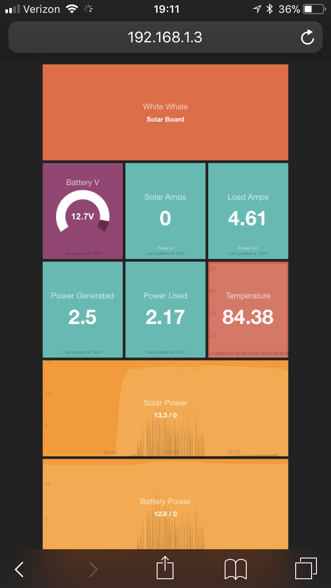

# epsolar-tracer
Tools for Connecting Tracer BN Solar Charger to Raspberry Pi with Python via rs485
===================================================

This is the second generation of the EPsolar Tracer solar charge controller. 
You need RS-485 adapter for communication. The first generation controller 
used RS-232 and a different protocol. see https://github.com/xxv/tracer.

This repo is a fork of [epsolar-tracer](https://github.com/kasbert/epsolar-tracer/)

Linux driver for Exar USB UART
------------------------------
Heres how to install the driver for a usb to rs-485 similar to the one [found here](https://www.amazon.com/gp/product/B016RU8JUY/ref=oh_aui_search_detailpage?ie=UTF8&psc=1)
The [xr_usb_serial_common](xr_usb_serial_common-1a/) directory contains the makefile and instructions that will compile properly on Rasbian OS on a raspberry pi 3. Before compiling be sure to install the linux headers with
`sudo apt-get install raspberrypi-kernel-headers`

After installing the headers be sure to `sudo bundle` then `sudo make`.
The resulting `xr_usb_serial_common.ko` file will need to be moved to `/lib/modules/YOUR_LINUX_VERSION/extra/`.
After building and moving the module, remove the cdc-acm driver that automatically installs for the usb-485 adapter.

`rmmod cdc-acm`
`modprobe -r usbserial`
`modprobe usbserial`

You will also need to add the cdc-acm to the system blacklist:

`echo blacklist cdc-acm > /etc/modprobe.d/blacklist-cdc-acm.conf`
Note: If echo doesnt work you will need to add `blacklist cdc-acm` manually to the blacklist with vim `vi /etc/modprobe.d/blacklist-cdc-acm.conf`

Finally add `xr_usb_serial_common` to '/etc/modules' to autoload the module on startup.

After all of this is done make sure that the new driver loads correctly by reloading the linux dependency list `depmod -ae`
Then load the module with `modprobe xr_usb_serial_common`

If all goes well you should see `ttyXRUSB` when listing `ls /dev/tty*`

Reboot and enjoy!

Protocol
--------
[Protocol](http://www.solar-elektro.cz/data/dokumenty/1733_modbus_protocol.pdf)

Python module
-------------
A simple script found in [dashing/jobs](dashing/jobs/getRegistery.py) will read a specific register from the solar charger. You can use this to test that your driver is working. Before running be sure to install the [Minimal Modbus](https://github.com/pyhys/minimalmodbus) python library.
Run the script like so:
`python getRegister.py 0x3100`
The script will return 0 if there is any kind of error.

The file `logsolar.py` will query the solar controller for relevant data and log it to a mysql database. You will need to update the file to point to your mysql db.
Uses [Minimal Modbus](https://github.com/pyhys/minimalmodbus) and mysqldb libraries

Setting up a cron job to run this script regularly is advisable if you intend to setup a dashboard.
To set up a cron job:
First make `logsolar.py` and executable file:
`sudo chmod +x logsolar.py`

Now add the cron job:
`crontab -e`
`*/5 * * * * /PATHTOREPO/logsolar.py`

Dashing.io Dashboard
--------------------

The Dashing folder contains everything needed to setup a dashboard to monitor realtime and historical solar charging data. Install dashing and created a new project, then copy the files from the dashing folder into your new dashing project. The path to the phython script in /jobs/ will need to be changed.

Starting Raspberry Pi as a Local Network + Web Service
------------------------------------------------------

https://www.raspberrypi.org/documentation/configuration/wireless/access-point.md
Actually this one
https://github.com/SurferTim/documentation/blob/6bc583965254fa292a470990c40b145f553f6b34/configuration/wireless/access-point.md

[From](https://www.raspberrypi.org/forums/viewtopic.php?t=208664)
To set up an isolated AP:
Follow the instructions here: https://www.raspberrypi.org/documentati ... s-point.md up to but not including "ADD ROUTING AND MASQUERADE" section.
Comment out any "NETWORK={" entries in /etc/wpa_supplicant/wpa_supplicant.conf
Cold reboot

To disable the isolated AP to contact the internet for apt-get updates etc:
In /etc/default/hostapd set DAEMON_CONF=""
Reinstate the "NETWORK={" entries in /etc/wpa_supplicant/wpa_supplicant.conf for your home network ssid etc
Comment out the AP interface IP details in /etc/dhcpcd.conf
Cold Reboot reboot

https://raspberrypi.stackexchange.com/questions/37885/raspberry-pi-port-forwarding-with-nodejs-server

Starting Dashing on boot

https://gist.github.com/gregology/5313326

changing hostname
https://www.howtogeek.com/167195/how-to-change-your-raspberry-pi-or-other-linux-devices-hostname/

